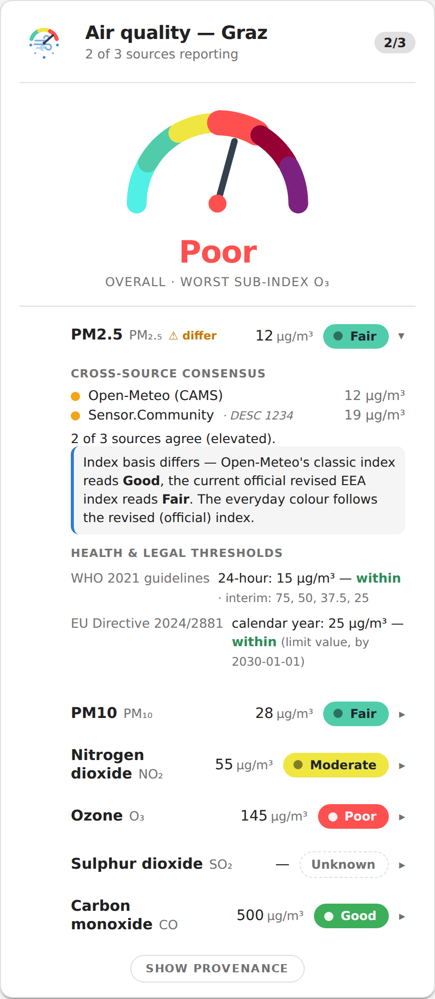
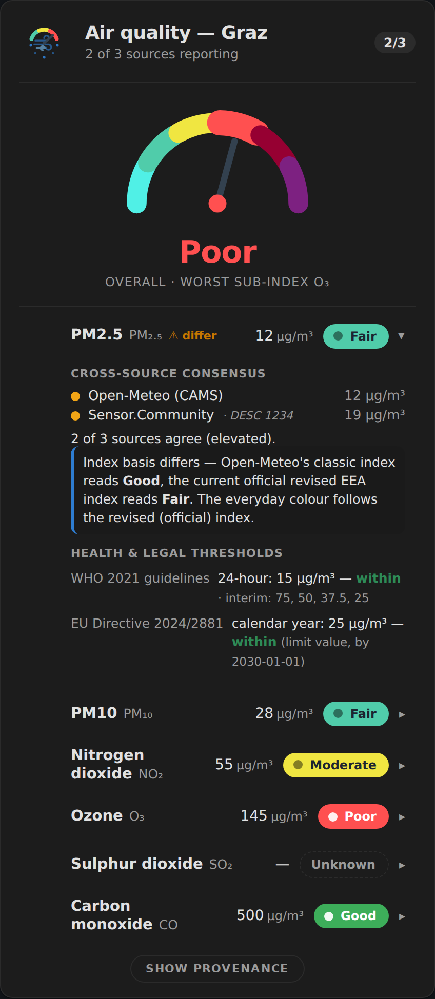
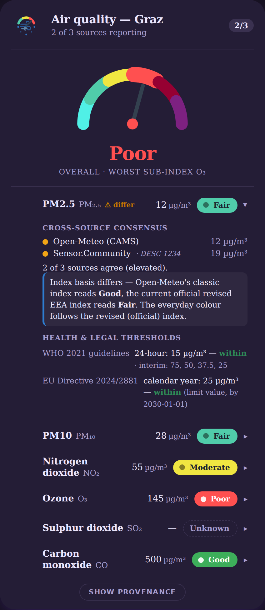

# AirWatch

Multi-source outdoor **air-quality** aggregator for Home Assistant, distributed
as a [HACS](https://hacs.xyz/) custom repository. Sibling project to
[PollenWatch](https://github.com/TheDave94/pollenwatch) — the same multi-source /
consensus / provenance architecture, re-skinned from pollen onto air-quality
pollutants.

> **Status: v1 released.** All three data sources work end-to-end (Open-Meteo /
> CAMS primary, plus the opt-in Sensor.Community and Land Steiermark secondaries),
> the integration sets up with live entities and cross-source analytics, and the
> bundled [Lovelace card](#lovelace-card) is done. Install today as a
> [HACS custom repository](#installation-hacs-custom-repository); not yet in the
> HACS default store (a separate submission).

## What it does

AirWatch fetches outdoor air-quality data, normalises it across sources, and
layers cross-source analytics on top — so you can see not just *a* number but
**how much the sources agree**, **where the threshold sits**, and **whose
threshold it is**.

- **Primary source — [Open-Meteo](https://open-meteo.com/) / CAMS:** free,
  keyless, hourly, EU-wide µg/m³, with a 92-day backfill and ~5-day forecast.
- **Secondary source — [Sensor.Community](https://sensor.community/)** *(opt-in):*
  hyperlocal citizen PM2.5/PM10 sensors. Auto-discovers the nearest stations (or
  use explicit station IDs), averages the valid ones, and **rejects SDS011 fault
  readings** (the stuck-at-max 999.9) and stale data. Enabling it gives the
  consensus/divergence analytics a second source to cross-check Open-Meteo.
- **Secondary source — Land Steiermark / Austrian network** *(opt-in, drift
  anchor):* the official monitoring stations, reached through the community
  [OGC SensorThings](https://www.ogc.org/standard/sensorthings/) harvest of the
  Austrian feeds (DataCove / API4INSPIRE). This is a **lagged, best-effort feed**
  — a *slow reference / drift anchor*, not a live source. AirWatch picks the
  nearest usable Steiermark station (or an explicit station ID), and every
  reading carries **which station, when, and how old it is**; data older than the
  drift-anchor window is reported as *unavailable* rather than shown as current.
  See [Thresholds & provenance](#thresholds--provenance) for the "expose, don't
  assert" rationale this follows.
- **Pollutants:** PM2.5, PM10, NO₂, O₃, SO₂, CO, and the European AQI index.

## Sensors

Per enabled source, per selected pollutant:

- **Raw concentration** — the source's reported value in its native unit
  (µg/m³), with `state_class: measurement` for long-term statistics. Each
  pollutant carries the correct Home Assistant `device_class` (`pm25`, `pm10`,
  `nitrogen_dioxide`, `ozone`, `sulphur_dioxide`, `aqi`).
- **Recent percentile** — today's daily peak ranked against the trailing ~92
  days (self-baselined from Open-Meteo's backfill).

Across sources, per pollutant:

- **Consensus** — `good` / `elevated` / `high` / `mixed`, with an *n/m* badge of
  how many sources contributed, plus the per-source levels.
- **Divergence** (binary sensor) — flags when sources disagree by more than one
  level.

> **Severity basis (changed):** the `good` / `elevated` / `high` severity level
> behind consensus, divergence and each raw sensor's `level` is now computed on
> the **2024 revised, WHO-aligned EEA index** (the current official, health-aligned
> index) — *not* the classic EAQI scale. **Ratings are stricter than the classic
> EAQI scale by design** in the common concentration range (the recalibration
> lowers the Good/Fair cut-points to the WHO guidelines; note the upper bands span
> wider ranges, so at very high concentrations the revised band can sit lower than
> the classic one). Carbon monoxide isn't in either EAQI, so its severity is driven
> directly by WHO/EU (onset at the WHO 24-hour AQG, high at the WHO 8-hour / EU
> limit). `european_aqi` keeps its native classic-index meaning.

## Thresholds & provenance

AirWatch **exposes the authority of every band rather than asserting a verdict**
(the model inherited from PollenWatch's `threshold_status`). Every value is traced
to its primary source in [`THRESHOLDS.md`](THRESHOLDS.md). Each raw sensor carries
a `bands` attribute keyed by **distinct authority**, never collapsed:

- **WHO 2021 global air-quality guidelines** (`who_2021`) — the health overlay,
  carried **in full**: the AQG level **and** the interim targets (IT-1…IT-n) for
  **each** averaging window WHO defines per pollutant (annual / 24-hour / 8-hour /
  peak-season), each citing its WHO-commissioned systematic-review DOI.
- **WHO retained short-averaging values** (`who_retained`) — the 2000/2005
  guidelines WHO 2021 states *remain valid* (NO₂ 1-h 200, SO₂ 10-min 500, CO
  8-h/1-h/15-min). These are the genuinely **hour-comparable** WHO numbers, so the
  averaging mismatch is resolved with real WHO science, not just a caveat.
- **Classic EAQI** (`eaqi_classic`) — the index Open-Meteo's `european_aqi`
  numerically returns; retained for provenance/display.
- **Revised EEA index** (`eaqi_eea_2024`) — the 2024 WHO-aligned official index
  (the **severity driver**, above). The divergence between what Open-Meteo's index
  *says* and what the current official index says is itself surfaced as provenance.
- **EU standards** — Directive **(EU) 2024/2881** (`eu_2024_2881`), in force, with
  **both** statutory milestones (attain by 2026 ≈ the old values; by 2030
  tightened toward WHO), each dated; the repealed **2008/50/EC** values are kept as
  `eu_2008_50_ec` tagged `status: repealed` (history is provenance).

Each `bands` entry is tagged with its **authority + value + averaging window**
(WHO/EU authorities as a list of per-window entries). The US EPA AQI is a reserved
authority — not populated in v1 (needs per-pollutant ppb/ppm conversion + the
piecewise AQI computation, and is US-centric for an EU/CAMS integration).

### Carbon monoxide units

Open-Meteo reports CO in µg/m³, but Home Assistant's `carbon_monoxide`
`device_class` accepts ppm only. Rather than bake in a temperature/pressure
conversion, AirWatch keeps the **native µg/m³** value (no `device_class`;
`state_class: measurement` preserves statistics) and exposes a converted **ppm**
value as a clearly-labelled attribute (with its conversion assumptions). This
also matches the WHO/EU mass-concentration basis used for CO bands.

## Installation (HACS custom repository)

1. HACS → ⋮ → **Custom repositories** → add `https://github.com/TheDave94/airwatch`
   as an **Integration**.
2. Install **AirWatch**, then restart Home Assistant.
3. **Settings → Devices & Services → Add Integration → AirWatch.** Pick your
   location and the pollutants to track; AirWatch probes Open-Meteo coverage
   before finishing.

## Lovelace card

Installing AirWatch also delivers a bundled **`custom:airwatch-card`** — one
install, no separate HACS-frontend step. The integration serves and registers the
card automatically on first load, so it appears in the card picker after a refresh
(hard-reload the browser if you don't see it).

| Light theme | Dark theme |
|---|---|
|  |  |

The chrome is **theme-native** — surface, text and font come from your Home
Assistant theme, while the EEA gauge, severity ramp and pollutant glyphs keep their
fixed identity on any theme:



The card follows a **progressive-disclosure** model:

- **At a glance (always visible):** a headline severity — the *worst* revised-EEA
  sub-index across your pollutants, with the official EEA colour ramp — plus one
  compact row per pollutant showing its current reading and its own revised-EEA
  band colour. This is "what is the air doing now."
- **On tap (the depth):** each pollutant row expands to its **multi-authority
  provenance** — what WHO 2021 (per averaging window + interim targets) and EU
  2024/2881 (both statutory milestones) say about that reading, the
  **classic-vs-revised EEA** index divergence ("Open-Meteo's index says X, the
  current official index says Y"), and the **cross-source consensus** (n/m
  sources, agree / disagree). CO is shown on its WHO/EU basis, not a faked EAQI
  band.

It handles the states the data layer actually produces: a stale or all-invalid
source reads as **Unknown** (the fail-safe, never a fake green), a disabled source
(Land Steiermark is off by default) simply drops out of the consensus, and missing
pollutants are omitted.

### Card configuration

All options are optional — with no config the card discovers the entry's selected
pollutants over WebSocket (falling back to an entity scan) and shows them all. Use
the visual editor, or YAML:

```yaml
type: custom:airwatch-card
title: Air quality          # header title (default: "Air quality")
expanded_default: false     # start with every row's provenance expanded
brand_font: false           # opt-in AirWatch brand font (loads a web font); default theme-native
pollutants:                 # optional subset / explicit order; default = all configured
  - pm2_5
  - pm10
  - nitrogen_dioxide
  - ozone
  - carbon_monoxide
sources:                    # optional filter for the glance reading; default = all enabled
  - open_meteo
  - sensor_community
```

| Option | Type | Default | Meaning |
|---|---|---|---|
| `title` | string | `Air quality` | Card header. |
| `pollutants` | list | discovered | Which pollutants to show, in order. Blank = all configured. |
| `sources` | list | all enabled | Restrict the glance reading to these sources (consensus still shows every source). |
| `expanded_default` | bool | `false` | Expand all provenance on load. |
| `brand_font` | bool | `false` | Use the AirWatch brand display font (Bricolage) for the title + hero word; loads a web font. Off = fully theme-native (no external request). |

The card is **theme-native**: its surface, text colours and font come from your
Home Assistant theme (the EEA gauge, severity ramp, glyphs and air accent keep
their fixed identity). See [`brand/HA_CARD_REVIEW.md`](brand/HA_CARD_REVIEW.md).

## Roadmap

| | |
|---|---|
| Open-Meteo / CAMS primary source | ✅ implemented, live-verified |
| Coordinators · config flow · entities (raw / percentile / consensus / divergence) | ✅ implemented |
| Pollutant registry · WHO + EAQI bands · provenance | ✅ implemented |
| Governance (cleanroom no-loss gates · release-please · CI) | ✅ ported |
| Sensor.Community secondary source (fault-rejecting, consensus-enabled) | ✅ implemented, live-verified |
| Land Steiermark drift-anchor source (SensorThings, lag-aware, disabled by default) | ✅ implemented, live-verified |
| Lovelace card (revised-EEA colour ramps · progressive provenance disclosure) | ✅ implemented |
| First release · installable as a HACS custom repository | ✅ |
| HACS default-store inclusion | ⛔ separate submission |

Design rationale lives in the HA-config atlas:
`docs/atlas/air-quality-fusion-roadmap.md` §9 (in the `homeassistant-config`
repo).

## License

MIT.
